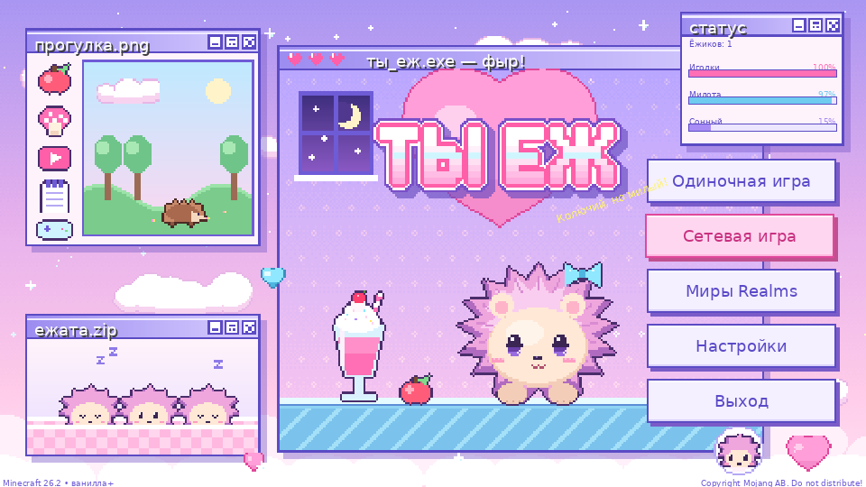

# Ты Еж — главное меню (Fabric, Minecraft 26.2)

Пастельное пиксельное главное меню в стиле «ретро-рабочего стола» для сборки ванилла+.
Вся графика оригинальная (нарисована генератором `tools/gen_textures.py`).


*Макет раскладки (шрифт на макете условный — в игре используется шрифт Minecraft).*

## Что внутри

- Большой логотип **«ТЫ ЕЖ»** в сердечке, пиксельный шрифт ручной отрисовки.
- Окошки «рабочего стола»: `ты_еж.exe`, `прогулка.png`, `ежата.zip`, `статус`
  (шкалы «Иголки», «Милота», «Сонный» слегка «живут»).
- Ёжик с бантиком: покачивается и моргает; облака плывут, звёзды мерцают, сердечки всплывают.
- Жёлтый сплэш-текст у логотипа (12 вариантов, случайный при открытии).
- Кнопки на русском: **Одиночная игра, Сетевая игра, Миры Realms, Настройки, Выход**
  (+ **Моды**, если установлен Mod Menu). Наведение — розовая подсветка и сердечко.
- Английская локализация тоже есть (`en_us.json`) — на случай, если язык игры английский.

## Сборка jar

Нужен **JDK 25**.

**Вариант 1 — IntelliJ IDEA:** File → Open → папка проекта. IDEA сама скачает
Gradle 9.5.1 (из `gradle/wrapper/gradle-wrapper.properties`). Затем Gradle → Tasks → build → `build`.

**Вариант 2 — консоль (установлен Gradle 9.x):**
```
gradle wrapper      # один раз, создаст gradlew
./gradlew build
```

**Вариант 3 — без установки чего-либо:** залейте папку в репозиторий GitHub —
workflow `.github/workflows/build.yml` соберёт мод, jar появится во вкладке Actions → Artifacts.

Готовый файл: `build/libs/tyezh-menu-1.0.0+26.2.jar` → положить в `mods/`.
Нужен только Fabric Loader ≥ 0.19.3 (Fabric API **не** требуется).

## Как это устроено

- `GuiMixin` — в 26.2 `setScreen` переехал в `Gui`; миксин подменяет любой открываемый
  `TitleScreen` на `TyEzhTitleScreen`.
- Кнопки — обычные ванильные `Button` (работают мышь, Tab/Enter, озвучка), но прозрачные;
  рисуются своим стилем.
- Нажатие «Одиночная/Сетевая игра/Realms/Настройки/Моды» на миг открывает ванильный
  `TitleScreen` и нажимает в нём соответствующую кнопку. Поэтому сохраняется вся ванильная
  логика (предупреждение о сетевой игре, проверки Realms, кнопка Mod Menu), а «Назад»
  в любом подменю возвращает в меню «Ты Еж».

## Настройка

- Тексты — `src/main/resources/assets/tyezh/lang/ru_ru.json`.
- Картинки — `src/main/resources/assets/tyezh/textures/gui/*.png`
  (можно перерисовать вручную или поправить `tools/gen_textures.py` и запустить `python3 tools/gen_textures.py`, нужен Pillow).
- Цвета кнопок — константы `C_*` / `H_*` в `TyEzhTitleScreen.java`.

## Если сборка ругается

Проект написан под API 26.2 (Mojang-имена): `GuiGraphicsExtractor`, `extractRenderState`,
`extractBackground`, `Minecraft.gui.setScreen`. Если в вашей точной версии 26.2.x что-то
переименовали, ошибка компилятора укажет на строку — обычно это одно-два имени метода.
Версии Loader/Loom меняются в `gradle.properties` (актуальные — https://fabricmc.net/develop/).
