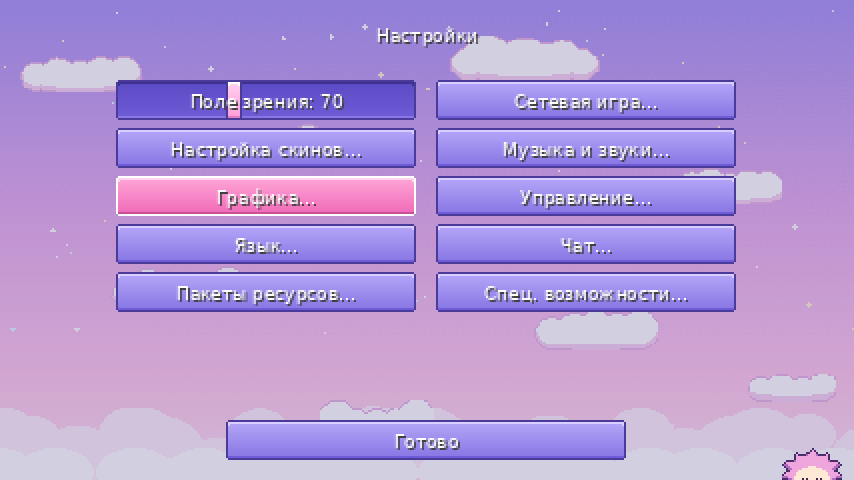
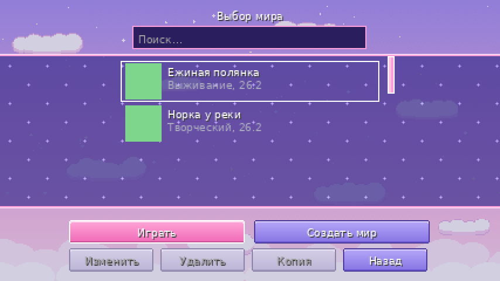
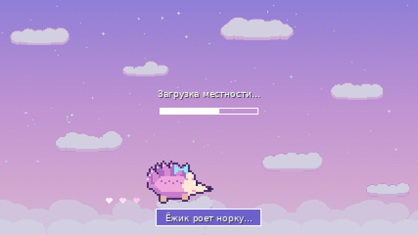

<div align="center">

# 🦔 Ты Еж — главное меню

**Пастельный пиксельный интерфейс для сборки «ванилла+»**

Minecraft **26.2** · Fabric Loader **0.19.3+** · Java **25** · Fabric API не нужен


</div>

---

## ✨ Возможности

**Главное меню**
- Логотип **«ТЫ ЕЖ»** в сердце, окошки ретро-«рабочего стола», шкалы статуса.
- Ёжик с бантиком покачивается и моргает. **Его можно погладить**: подпрыгнет и скажет «фыр!».
- Плывущие облака, мерцающие звёзды, всплывающие сердечки, случайный сплэш-текст.
- Кнопки на русском; кнопка «Моды» появляется, если установлен Mod Menu.

**Все меню вне мира**
- Настройки, выбор и создание мира, пакеты ресурсов и т.д. получают пастельное небо вместо панорамы.
- Кнопки, слайдеры, поля ввода, вкладки и полосы прокрутки перекрашены в тот же стиль.
- В углу экрана дремлет ёжик.

**Загрузка мира**
- Ёжик топает по экрану, оставляя сердечки.
- Подсказки меняются каждые несколько секунд: «Ёжик роет норку…», «Точим иголочки…» и другие.

**Звуки**
- Мягкий «блип» при наведении на кнопки и слайдеры.
- «Поп» с колокольчиком при нажатии вместо ванильного клика.
- «Фыр-фыр» при поглаживании ёжика.

| Настройки | Выбор мира | Загрузка |
|:---:|:---:|:---:|
|  |  |  |

> Скриншоты — макеты раскладки: шрифт на них условный, в игре используется шрифт Minecraft.

## 📥 Установка

1. Установите [Fabric Loader](https://fabricmc.net/use/installer/) для Minecraft 26.2.
2. Скачайте jar (см. ниже) и положите в папку `mods`.

### Где взять jar

- **Actions:** вкладка **Actions** → последняя сборка с зелёной галочкой → раздел **Artifacts** → `tyezh-menu`.
  Внутри архива нужен файл **без** `-sources` в названии.
- **Releases:** если автор опубликовал релиз, jar лежит на странице **Releases**.

## 🛠 Сборка из исходников

Нужен **JDK 25**.

```bash
gradle wrapper    # один раз, если нет gradlew
./gradlew build
```

Готовый файл: `build/libs/tyezh-menu-<версия>.jar`.

Каждый push в репозиторий автоматически собирает мод через GitHub Actions (`.github/workflows/build.yml`).

## 📁 Структура

```
src/main/java/ru/tyezh/menu/
├── TyEzhTitleScreen.java      главное меню
├── TyEzhBackdrop.java         общий фон, ёжик на загрузке и в углу
├── TyEzhSounds.java           звуки наведения и «фыр»
└── mixin/
    ├── GuiMixin.java              подмена ванильного главного меню
    ├── ScreenMixin.java           фон для всех меню вне мира
    └── AbstractWidgetMixin.java   звук наведения на кнопки

src/main/resources/assets/
├── tyezh/        свои текстуры, звуки, переводы (ru_ru, en_us)
└── minecraft/    стиль ванильных кнопок/слайдеров/списков и замена звука клика

tools/            генераторы графики и звуков (Python)
```

## 🎨 Настройка под себя

| Что поменять | Где |
|---|---|
| Тексты кнопок, сплэши, подсказки загрузки | `assets/tyezh/lang/ru_ru.json` |
| Картинки главного меню | `assets/tyezh/textures/gui/` |
| Стиль ванильных кнопок и списков | `assets/minecraft/textures/gui/` |
| Звуки | `assets/tyezh/sounds/ui/*.ogg` (моно, Ogg Vorbis) |
| Громкость звуков | `assets/tyezh/sounds.json`, `assets/minecraft/sounds.json` |
| Цвета кнопок главного меню | константы `C_*` / `H_*` в `TyEzhTitleScreen.java` |

Графику и звуки можно пересоздать скриптами:

```bash
python3 tools/gen_textures.py   # главное меню (нужен Pillow)
python3 tools/gen_ui.py         # кнопки, списки, ёжики для загрузки
python3 tools/gen_sounds.py     # звуки (нужны numpy и ffmpeg)
```

## 🧩 Совместимость

- Только клиент; на сервер ставить не нужно.
- Внутри мира (меню паузы, инвентарь) фон остаётся ванильным, чтобы было видно игру.
- Ресурспаки, меняющие кнопки, стоит ставить **выше** мода, если нужен их стиль.
- Мод рассчитан на API Minecraft 26.2. Если в новой версии что-то переименуют,
  ошибка сборки укажет на конкретную строку.

## 📜 Лицензия

[MIT](LICENSE). Вся графика и звуки оригинальные и сгенерированы скриптами из папки `tools/`.
